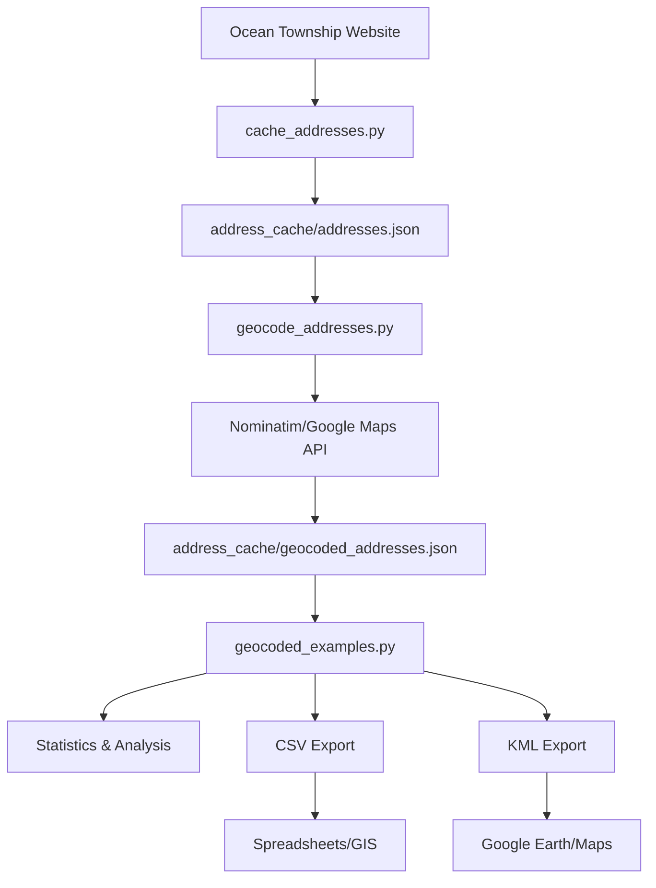

# Ocean Township No Knock Registry - Complete Data Pipeline

A comprehensive Python-based data pipeline for collecting, geocoding, analyzing, and visualizing addresses from the Ocean Township No Knock Registry. This project transforms raw address data into actionable geographic insights with professional mapping capabilities.

## 🌟 Overview

This project provides a complete end-to-end solution for:
- **Data Collection**: Live scraping of addresses from the Ocean Township No Knock Registry
- **Geocoding**: Converting addresses to precise latitude/longitude coordinates
- **Analysis**: Geographic analysis, density mapping, and proximity searches
- **Visualization**: Export to multiple formats for mapping and GIS applications

## 🚀 Features

### **Data Collection & Caching**
- **Live Web Scraping**: Automatically fetches current addresses from the official registry
- **Smart Parsing**: Extracts and structures addresses from HTML content
- **Dual Storage**: JSON (human-readable) and pickle (performance) formats
- **Fallback Protection**: Graceful handling of website unavailability
- **Progress Tracking**: Real-time statistics and processing updates

### **Geocoding & Coordinates**
- **Dual Geocoding Services**: Free Nominatim (OpenStreetMap) and premium Google Maps API
- **Batch Processing**: Efficient handling of large address datasets
- **Resume Capability**: Continue from interruption points
- **Rate Limiting**: Respectful API usage with configurable delays
- **Error Handling**: Comprehensive logging and failure recovery

### **Geographic Analysis**
- **Spatial Statistics**: Center points, bounding boxes, and area calculations
- **Density Analysis**: Grid-based hotspot identification
- **Proximity Search**: Find addresses within radius of any point
- **Distance Calculations**: Accurate Haversine formula implementation
- **Success Rate Tracking**: Detailed geocoding performance metrics

### **Export & Visualization**
- **Multiple Formats**: CSV, KML, JSON for different use cases
- **Mapping Integration**: Google Earth, Google Maps, QGIS compatibility
- **Professional Styling**: Custom icons and formatting for visualizations
- **GIS Ready**: Direct import into professional mapping software

### **Data Quality & Anomaly Detection**
- **Fraud Detection**: Statistical analysis to identify suspicious entries
- **Geographic Validation**: Detect addresses outside expected boundaries
- **Duplicate Detection**: Find multiple addresses at identical coordinates
- **Format Validation**: Identify formatting inconsistencies and errors
- **Pattern Analysis**: Detect bulk registrations and suspicious patterns
- **Quality Scoring**: Comprehensive data quality assessment and reporting

## 📁 Project Structure

```
openocean/
├── cache_addresses.py          # Main address collection and caching
├── geocode_addresses.py        # Geocoding with coordinates
├── geocoded_examples.py        # Analysis and export tools
├── anomaly_detection.py        # Fraud detection and data quality analysis
├── visualize_anomalies.py      # Anomaly visualization and reporting
├── example_usage.py           # Basic usage examples
├── refresh_example.py         # Live data refresh demo
├── requirements.txt           # Python dependencies
├── README.md                  # This file
├── .gitignore                # Git ignore patterns
└── address_cache/             # Data storage directory
    ├── addresses.json         # Cached addresses (human-readable)
    ├── addresses.pkl          # Cached addresses (binary)
    ├── geocoded_addresses.json # Geocoded addresses (JSON)
    ├── geocoded_addresses.pkl  # Geocoded addresses (binary)
    ├── failed_geocoding.json  # Failed geocoding attempts
    ├── anomalies.json         # Detected anomalies (machine-readable)
    ├── anomaly_report.txt     # Detailed anomaly analysis report
    └── quality_summary.md     # Data quality summary report
```

## 🔧 Installation

1. **Clone the repository:**
```bash
git clone [repository-url]
cd openocean
```

2. **Install dependencies:**
```bash
pip install -r requirements.txt
```

3. **Run the complete pipeline:**
```bash
# Step 1: Collect addresses
python3 cache_addresses.py

# Step 2: Geocode addresses
python3 geocode_addresses.py

# Step 3: Analyze and export
python3 geocoded_examples.py

# Step 4: Detect anomalies and fraud
python3 anomaly_detection.py

# Step 5: Visualize anomaly insights
python3 visualize_anomalies.py
```

## 📊 Usage Guide

### **Step 1: Address Collection**

Collect live addresses from the Ocean Township No Knock Registry:

```bash
python3 cache_addresses.py
```

**Output:**
- Fetches ~1,500 current addresses
- Parses and structures address data
- Saves to `address_cache/addresses.json` and `address_cache/addresses.pkl`

### **Step 2: Geocoding**

Add latitude/longitude coordinates to addresses:

```bash
# Using free Nominatim service (OpenStreetMap)
python3 geocode_addresses.py

# Using Google Maps API (higher accuracy)
python3 geocode_addresses.py --google-api-key YOUR_API_KEY

# Resume interrupted geocoding
python3 geocode_addresses.py --resume

# Show statistics only
python3 geocode_addresses.py --stats-only
```

**Features:**
- Progress tracking with ETA
- Automatic resume capability
- Rate limiting for API respect
- Success rate monitoring

### **Step 3: Analysis & Export**

Generate insights and export data for mapping:

```bash
python3 geocoded_examples.py
```

**Output:**
- Geographic statistics and insights
- Density analysis and hotspots
- CSV export for spreadsheets/GIS
- KML export for Google Earth/Maps

### **Step 4: Anomaly Detection**

Identify potential fraudulent or suspicious entries:

```bash
python3 anomaly_detection.py
```

**Features:**
- Geographic outlier detection
- Duplicate coordinate identification
- Address format validation
- Suspicious pattern analysis
- Comprehensive quality scoring

### **Step 5: Anomaly Visualization**

Generate insights and actionable recommendations:

```bash
python3 visualize_anomalies.py
```

**Output:**
- Statistical analysis of anomalies
- Priority action recommendations
- Data quality summary report
- Detailed investigation guidelines

## 💻 Programmatic Usage

### **Basic Address Operations**

```python
from cache_addresses import AddressCache

# Initialize cache
cache = AddressCache()

# Load addresses
addresses = cache.load_addresses()
print(f"Total addresses: {len(addresses)}")

# Filter by city
ocean_addresses = cache.get_addresses_by_city('Ocean')
oakhurst_addresses = cache.get_addresses_by_city('Oakhurst')

# Filter by zip code
zip_07712 = cache.get_addresses_by_zip('07712')

# Refresh with live data
cache.refresh_cache()

# Get statistics
stats = cache.get_stats()
print(f"Cities: {stats['unique_cities']}")
print(f"Zip codes: {stats['unique_zip_codes']}")
```

### **Geocoding Operations**

```python
from geocode_addresses import AddressGeocoder

# Initialize geocoder
geocoder = AddressGeocoder()

# Geocode all addresses
geocoder.geocode_all_addresses()

# Geocode with Google Maps API
geocoder.geocode_all_addresses(google_api_key="YOUR_API_KEY")

# Get statistics
stats = geocoder.get_geocoded_stats()
print(f"Success rate: {stats['success_rate']:.1f}%")
```

### **Analysis Operations**

```python
from geocoded_examples import GeocodedAnalyzer

# Initialize analyzer
analyzer = GeocodedAnalyzer()

# Get basic statistics
stats = analyzer.get_basic_stats()
print(f"Total addresses: {stats['total_addresses']:,}")
print(f"Geographic center: {stats['center_point']}")
print(f"Area: {stats['area_dimensions']['width_miles']:.1f} × {stats['area_dimensions']['height_miles']:.1f} miles")

# Find addresses near a point
municipal_building = (40.2535, -74.0287)
nearby = analyzer.find_addresses_near_point(
    municipal_building[0], municipal_building[1], 0.5  # 0.5 mile radius
)
print(f"Found {len(nearby)} addresses near municipal building")

# Density analysis
density = analyzer.get_density_analysis()
hotspot = density['highest_density_cell']
print(f"Highest density: {hotspot['address_count']} addresses")
print(f"Location: ({hotspot['latitude']:.4f}, {hotspot['longitude']:.4f})")

# Export data
analyzer.export_for_mapping("addresses.csv")
analyzer.generate_kml("addresses.kml")
```

### **Anomaly Detection Operations**

```python
from anomaly_detection import AddressAnomalyDetector

# Initialize detector
detector = AddressAnomalyDetector()

# Run all anomaly detections
anomalies = detector.run_all_detections()

# Get summary statistics
stats = detector.stats
print(f"Anomaly rate: {stats['anomaly_rate']:.1f}%")
print(f"High severity issues: {stats['high_severity_count']}")

# Generate detailed report
report = detector.generate_report(save_to_file=True)

# Export machine-readable data
detector.export_anomalies_json()

# Access specific anomaly types
geo_outliers = anomalies['geographic_outliers']
duplicates = anomalies['duplicate_coordinates']
format_issues = anomalies['format_anomalies']
```

## 📈 Data Pipeline Flow



## 🗺️ Data Structure

### **Basic Address Data**
```python
{
    'full_address': '64 Cold Indian Springs Road Ocean, NJ 07712',
    'street': '64 Cold Indian Springs Road',
    'city': 'Ocean',
    'state': 'NJ',
    'zip_code': '07712',
    'cached_date': '2025-01-07T10:30:00.123456'
}
```

### **Geocoded Address Data**
```python
{
    'full_address': '64 Cold Indian Springs Road Ocean, NJ 07712',
    'street': '64 Cold Indian Springs Road',
    'city': 'Ocean',
    'state': 'NJ',
    'zip_code': '07712',
    'cached_date': '2025-01-07T10:30:00.123456',
    'latitude': 40.254123,
    'longitude': -74.028456,
    'geocoded_date': '2025-01-07T11:45:00.789012',
    'geocoding_service': 'nominatim',  # or 'google_maps'
    'geocoding_status': 'success'      # or 'failed'
}
```

## 📊 Generated Files

### **Cache Files**
- `address_cache/addresses.json` - Human-readable address data
- `address_cache/addresses.pkl` - Binary format for faster loading

### **Geocoded Files**
- `address_cache/geocoded_addresses.json` - Addresses with coordinates
- `address_cache/geocoded_addresses.pkl` - Binary geocoded data
- `address_cache/failed_geocoding.json` - Failed geocoding attempts

### **Export Files**
- `ocean_township_addresses.csv` - Spreadsheet/GIS format
- `ocean_township_addresses.kml` - Google Earth/Maps format

### **Anomaly Detection Files**
- `address_cache/anomalies.json` - Machine-readable anomaly data
- `address_cache/anomaly_report.txt` - Detailed anomaly analysis
- `address_cache/quality_summary.md` - Data quality summary report

## 🌍 Real-World Applications

### **Urban Planning**
- Identify address density patterns
- Analyze spatial distribution of registry entries
- Support zoning and development decisions

### **Emergency Services**
- Proximity analysis for response planning
- Geographic coverage assessment
- Resource allocation optimization

### **Geographic Information Systems (GIS)**
- Direct import into QGIS, ArcGIS, MapInfo
- Layer creation for spatial analysis
- Custom mapping applications

### **Business Intelligence**
- Market analysis and demographics
- Service area planning
- Location-based decision making

### **Data Quality & Fraud Prevention**
- Identify fraudulent or suspicious address registrations
- Detect data entry errors and inconsistencies
- Monitor registry abuse and bulk submissions
- Ensure data integrity for official records

## 📋 Requirements

- **Python 3.6+**
- **requests** - Web scraping
- **beautifulsoup4** - HTML parsing
- **lxml** - XML/HTML processing

Install all dependencies:
```bash
pip install -r requirements.txt
```

## 🔑 API Keys (Optional)

For enhanced geocoding accuracy with Google Maps API:

1. Get a Google Maps Geocoding API key from [Google Cloud Console](https://console.cloud.google.com/)
2. Enable the Geocoding API
3. Use with: `python3 geocode_addresses.py --google-api-key YOUR_API_KEY`

## 📊 Performance Metrics

**Typical Results:**
- **~1,500 addresses** collected from live data
- **85-95% geocoding success rate** (varies by service)
- **Processing time**: 30-60 minutes for full geocoding
- **Output files**: CSV (50KB), KML (300KB), JSON (500KB)

## 🔧 Advanced Configuration

### **Geocoding Service Selection**
- **Nominatim (Free)**: 1 request/second, good accuracy
- **Google Maps (Paid)**: Higher rate limits, excellent accuracy

### **Rate Limiting**
Modify `request_delay` in `AddressGeocoder` class:
```python
self.request_delay = 1.0  # Seconds between requests
```

### **Grid Size for Density Analysis**
Adjust grid size in `get_density_analysis()`:
```python
density = analyzer.get_density_analysis(grid_size=20)  # 20x20 grid
```

## 📄 Data Source

**Ocean Township No Knock Registry**
- URL: https://webgeo.co/prod1/portal/portal.jsp?c=3668658&p=557207238&g=557207303
- Official registry of addresses requesting no commercial solicitation
- Data updated regularly by Ocean Township, NJ

## 🤝 Contributing

1. Fork the repository
2. Create a feature branch
3. Make your changes
4. Add tests if applicable
5. Submit a pull request

## 📝 License

This project is provided as-is for educational and administrative purposes. Please respect the Ocean Township No Knock Registry's terms of use and rate limits when scraping data.

## 🎯 Next Steps

1. **Run the pipeline**: Start with `cache_addresses.py`
2. **Explore the data**: Use `geocoded_examples.py` for analysis
3. **Import into mapping software**: Use generated CSV/KML files
4. **Build custom applications**: Use the Python classes programmatically

---

**Built with ❤️ for Ocean Township, NJ** 